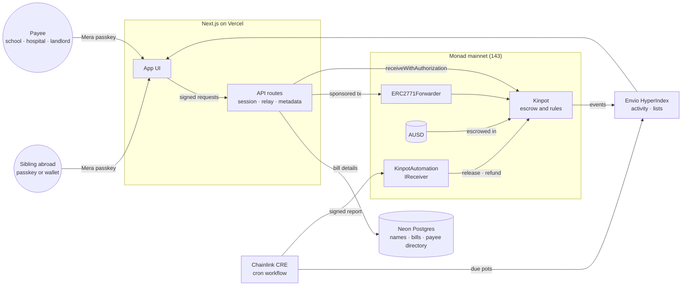
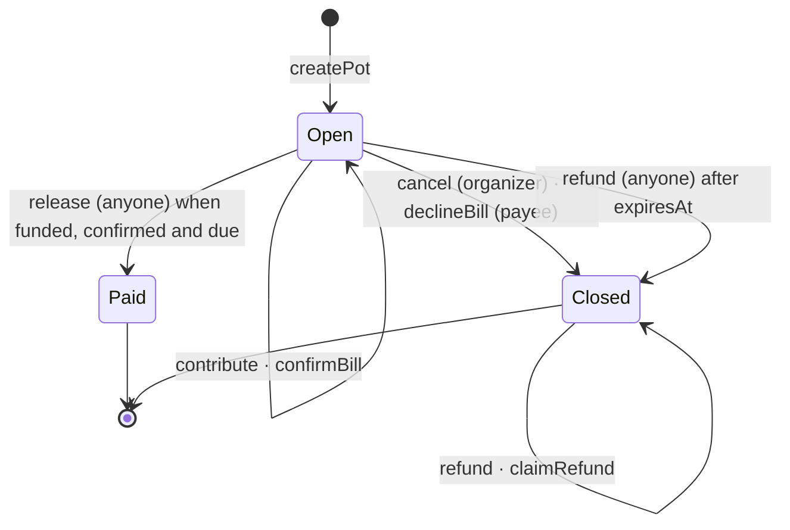
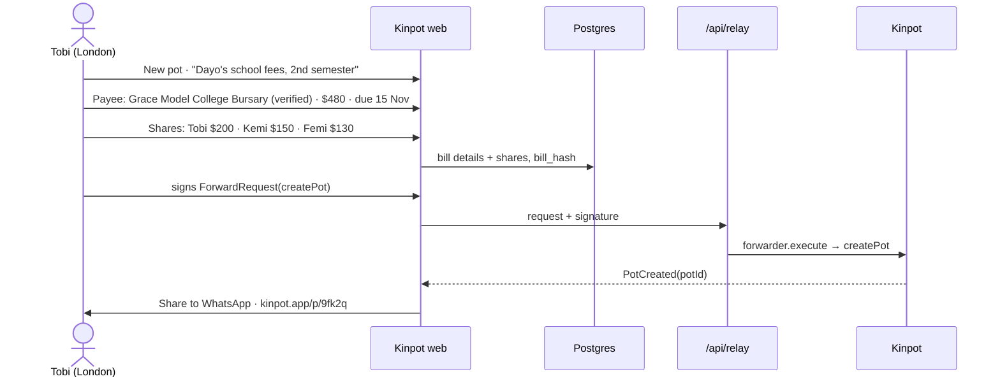
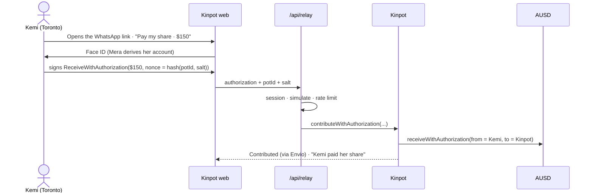
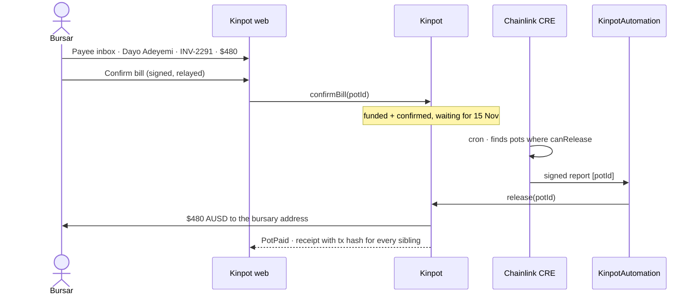

# Kinpot Architecture

> Pay the bill, not the person.

Kinpot lets siblings abroad co-fund a family bill back home (Mummy's hospital bill, Tobi's school fees, the rent) in AUSD on Monad. The money sits in a pot locked to one payee, such as a school bursary, a hospital or a landlord, and to one due date. It moves only when the pot is fully funded, the payee has confirmed the bill is real and the due date has arrived, and then it goes straight to the payee. If any of that doesn't happen, every sibling gets their share back automatically. Family members and payees sign in with a passkey. They never see a seed phrase, never need a gas token, and the main flow never mentions a blockchain.

Built for **Monad Metropolis** (Consumer Products & Payments track). Submissions close 13 Oct 2026.

---

## 1. Why this, and what's different

The Nigerian diaspora sends home over $20B a year, and a lot of it is earmarked for a specific bill that gets paid through a relative. School-fee scams are common enough that diaspora communities now tell each other to pay schools directly. When three siblings split a bill today, it means three transfers to one person, a spreadsheet in the family WhatsApp group, and trust.

| | **Kinpot** | MoneyHive (fiat, UK) | Hawamoney (Monad) | Spraying apps (Nawo, Spooray) |
|---|---|---|---|---|
| Several senders fund one bill | **Yes, with per-sibling shares** | No, one sender | Group treasury | No |
| Money locked to a named payee | **Yes, onchain** | Yes, by the operator | No | No |
| The payee confirms the bill before release | **Yes** | Not documented | No | No |
| Automatic refund if it doesn't go ahead | **Yes, by the contract** | Operator process | No | No |
| Anyone can verify who paid and where it went | **Yes** | No | Partly | No |
| Sign-in | Passkey, no gas token | Bank account | Wallet | Bank account |

Our angle: **escrow plus co-funding plus payee confirmation.** The school, not the cousin, says "this bill is real," and the contract, not a person, decides when the money moves.

## 2. Design principles

| # | Principle | Consequence |
|---|---|---|
| P1 | **Money only goes to stored addresses.** | AUSD leaves a pot only to its payee (release) or to the contributors who paid it in (refund). No function takes a destination from the caller. |
| P2 | **Release needs three facts, all checked onchain.** | Fully funded, payee confirmed, due date reached. Nobody can release early or partially. |
| P3 | **Completion is permissionless.** | `release` and `refund` can be called by anyone: our keeper, Chainlink CRE, a sibling or a block explorer user. Kinpot going offline can't strand a pot. |
| P4 | **Zero admin.** | No owner, pause, upgrade or fee switch on `Kinpot`. The relayer is untrusted: it can only submit what users signed. |
| P5 | **Gasless for everyone, without custody.** | Contributions use AUSD's EIP-3009 `receiveWithAuthorization`. Other actions go through an OZ `ERC2771Forwarder`. Our relayer pays MON for gas and never holds user funds. |
| P6 | **Chain for money, database for context.** | Postgres stores names, bill details and the payee directory. It never decides a money movement. The bill details are hashed onchain so anyone can check they weren't edited. |
| P7 | **Failures are isolated per contributor.** | A refund that can't be delivered to one address doesn't block anyone else's. It stays claimable. |

## 3. System overview



| Component | Trust level | Role |
|---|---|---|
| `Kinpot` | Immutable, no admin | Holds every pot's AUSD with per-pot accounting. The state machine, release and refunds. |
| `ERC2771Forwarder` (OpenZeppelin) | Immutable | Verifies users' EIP-712 signed requests so the relayer can pay gas for `createPot`, `confirmBill`, `declineBill` and `cancel`. |
| `KinpotAutomation` | Immutable | Chainlink CRE `IReceiver`. Decodes a report of pot IDs and calls `release` or `refund` on each, isolated by `try/catch`. Accepts reports only from the Chainlink forwarder. |
| Web app (Next.js) | Untrusted convenience | Every screen, plus API routes for the relayer, bill details, names, the payee directory and the fallback keeper. |
| Relayer (`/api/relay`) | Untrusted, gas only | Holds a MON-funded hot key. It simulates, rate-limits and submits signed requests. Losing the key costs the MON budget, never user funds. |
| Neon Postgres | Context only | Profiles, payee directory, bill details, sibling shares, relay log. |
| Envio HyperIndex | Read model | Indexes `Kinpot` events into pot lists, the payee inbox and the activity feed (GraphQL). |
| Chainlink CRE workflow | Untrusted trigger | Every minute it reads `KinpotAutomation.pending()` and, if anything is due or expired, sends a signed report of pot IDs to `KinpotAutomation`. |
| Fallback keeper (`/api/keeper`) | Untrusted trigger | Called every 5 minutes by a GitHub Actions schedule. Reads the same `pending()` and calls `release` / `refund` through the relayer. |

## 4. Contracts

### 4.1 Pot

```solidity
enum Status { Open, Paid, Closed }

struct Pot {
    address organizer;      // who created it; can cancel while Open
    uint40  dueAt;          // earliest release
    uint40  expiresAt;      // after this, an unpaid pot can only refund
    Status  status;
    bool    payeeConfirmed; // payee has confirmed the bill
    address payee;          // the only address a release can pay
    uint96  target;         // bill amount in AUSD (6 dp)
    uint96  raised;         // sum of contributions, never above target
    bytes32 billHash;       // keccak256 of the bill details stored off-chain
}

mapping(uint256 potId => mapping(address => uint256)) contributed;
mapping(uint256 potId => address[]) contributors;   // unique, at most 32 per pot
mapping(uint256 potId => mapping(address => uint256)) refundOwed;
```

`Kinpot` is a single contract holding every pot's AUSD, not one clone per pot. Kinfolio used clones because it held allowances. Here funds are escrowed, so per-pot accounting in one contract is cheaper and easier to index, and invariant I3 below proves it's solvent.

### 4.2 State machine



Timing, all `block.timestamp`:

- Releasable when `raised == target && payeeConfirmed && dueAt <= now <= expiresAt`.
- Refundable when `status == Closed`, or `status == Open && now > expiresAt`.
- The two windows never overlap, so release and refund can't race.

### 4.3 Function matrix

| Function | Caller | Allowed in | Effect |
|---|---|---|---|
| `createPot(payee, target, dueAt, expiresAt, billHash)` | anyone (via forwarder or direct) → organizer | n/a | Validates `payee != 0`, `payee != organizer`, `target > 0`, `now <= dueAt <= expiresAt <= now + 365 days`. Emits `PotCreated`. |
| `contribute(potId, amount)` | anyone with an AUSD allowance | Open, before `expiresAt` | `amount <= target - raised`. Records the contributor. For wallet users who pay their own gas. |
| `contributeWithAuthorization(potId, from, amount, validAfter, validBefore, salt, sig)` | anyone (the relayer) | Open, before `expiresAt` | Calls `AUSD.receiveWithAuthorization(from, this, amount, …, nonce)` with `nonce = keccak256(abi.encode(potId, salt))`, so a signature can't be redirected to another pot. Credits `from`. |
| `confirmBill(potId)` | payee | Open | Sets `payeeConfirmed`. The payee is saying the bill and amount are real and they'll accept payment. |
| `declineBill(potId)` | payee | Open | → Closed. Refunds open. |
| `cancel(potId)` | organizer | Open | → Closed. Refunds open. Safe at any time, because money only returns to whoever paid it. |
| `release(potId)` | anyone | Open, releasable | → Paid. Transfers `target` to `payee`. Emits `PotPaid`. |
| `refund(potId)` | anyone | refundable | → Closed. Pushes each contributor's amount back with `trySafeTransfer`. Failures are recorded in `refundOwed` and emit `RefundFailed`. Bounded at 32 contributors. |
| `claimRefund(potId)` | contributor | Closed | Pulls their own `refundOwed`. |
| `canRelease(potId)` / `canRefund(potId)` | view | n/a | Used by the keeper and the UI. |

Events: `PotCreated`, `Contributed`, `BillConfirmed`, `BillDeclined`, `PotCancelled`, `PotPaid`, `Refunded`, `RefundFailed`.

### 4.4 Invariants (Foundry fuzz and invariant tests)

| ID | Invariant |
|---|---|
| I1 | AUSD leaves `Kinpot` only to a pot's stored payee (once, on release) or to one of its contributors (refund). |
| I2 | For every pot, `Σ contributed[c] == raised <= target`. |
| I3 | `AUSD.balanceOf(Kinpot) >= Σ raised (Open pots) + Σ refundOwed`. |
| I4 | `Paid` and `Closed` are terminal and mutually exclusive. A pot pays out at most once. |
| I5 | `release` succeeds only if `raised == target && payeeConfirmed && dueAt <= now <= expiresAt`. |
| I6 | No contributor is refunded more than they contributed. |
| I7 | No privileged role exists on `Kinpot`. |

Hardening: OZ `SafeERC20`, `ReentrancyGuard` on every function that moves tokens, checks-effects-interactions, bounded loops, and no `Multicall` (it has a known bad interaction with ERC-2771).

## 5. Gasless model

Mera gives each user a plain EOA derived from their passkey, and it has no paymaster. Family members and payees won't hold MON. So:

| Action | Signed by user | Submitted by | Mechanism |
|---|---|---|---|
| Contribute | `ReceiveWithAuthorization` (EIP-3009, on AUSD) | relayer | One signature, no approval transaction. The pot is bound through the nonce. |
| Create pot, confirm, decline, cancel | `ForwardRequest` (EIP-712, OZ forwarder) | relayer | `Kinpot` reads `_msgSender()`. |
| Release, refund | nothing | CRE, keeper or anyone | Permissionless. |

Relayer rules (`/api/relay`):

- Forwarded calls must target `Kinpot`, carry no value, and use an allowlisted function (`createPot`, `confirmBill`, `declineBill`, `cancel`, `claimRefund`). The request must pass `forwarder.verify` and be within its deadline.
- Every call is simulated first. Forwarded calls are also simulated directly as the signer, because the forwarder hides the inner revert reason, and users should see "Only the payee can do that," not "FailedCall."
- On Monad you pay for the gas limit you declare, not the gas used, so the relayer sets the limit to the estimate plus 15%.
- Rate limits apply per IP and per signer (in memory, best effort). The testnet faucet is limited per address.
- Wallet users can skip the relayer and pay their own gas with `contribute`.

## 6. Off-chain data

### 6.1 Postgres (Neon, Drizzle ORM)

| Table | Columns | Notes |
|---|---|---|
| `profiles` | `address` PK, `name`, `created_at` | The display name the family sees. Set with a signed EIP-712 `Profile` message. |
| `payees` | `id`, `address` unique, `name`, `kind` (school · hospital · landlord · utility · other), `city`, `verified`, `verified_note`, `created_by`, `created_at` | Verified institutions get a badge. Verification is manual during the hackathon. |
| `pots` | (`scope`, `pot_id`) PK, `slug` (random, used in the share link), `bill` jsonb (title, category, payee name, reference, note, shares), `bill_hash`, `organizer`, `payee`, `created_at` | `scope` is `chainId:kinpotAddress`, so a redeployed contract never inherits old rows. `bill_hash` must equal the onchain `billHash` or the API rejects the write. |
| `share_claims` | (`scope`, `pot_id`, `share_index`) PK, `address` | "I'm Kemi". Signed with an EIP-712 `ShareClaim`, accepted only after that address has contributed. |

### 6.2 Envio entities

`Pot` (mirrors onchain state plus `createdAt`, `paidAt`, `paidTx`), `Contribution`, `Refund`, `BillEvent` (confirmed, declined, cancelled), and `Activity` (a unified feed for the pot page). It's queried by organizer (my pots), payee (payee inbox), contributor and pot.

## 7. Key flows

### Flow 1: Create a pot and share it in the family group



### Flow 2: A sibling pays their share with a passkey, no gas



### Flow 3: The payee confirms, and the pot pays itself on the due date



The refund path is the same shape. A decline, a cancel or an expiry closes the pot, and CRE calls `refund`, which sends each sibling exactly what they put in.

For the demo, testnet pots use a due date two minutes out, so the whole lifecycle fits in the video.

## 8. Web app

Next.js 16 (App Router), React 19, wagmi 3, viem 2, TanStack Query and Tailwind 4, the same base as Kinfolio. A custom wagmi connector wraps Mera's viem `LocalAccount`, so passkey and injected wallets go through the same hooks.

| Route | What it is |
|---|---|
| `/` | What Kinpot does, shown with a real pot rather than a template hero. |
| `/new` | Create a pot: what it's for, payee (directory search, verified badge), amount with a naira estimate, due date, sibling shares, invoice reference. |
| `/p/[slug]` | The page shared to WhatsApp. Progress, who has paid their share, payee and confirmation status, due countdown, Pay my share, activity feed, and the receipt with tx hash once paid. |
| `/payee` | Payee inbox: incoming bills with references, confirm or decline, payments received. |
| `/me` | My pots, organized and contributed. |
| `/api/relay`, `/api/pots`, `/api/claims`, `/api/profile`, `/api/payees`, `/api/fx`, `/api/keeper` | Relayer, bill details, share claims, names, payee directory, naira rate, fallback keeper. |

**Design direction**

- **Type:** headings in a grotesk with character (Schibsted Grotesk), Inter for body text, and JetBrains Mono with tabular figures for amounts, addresses and hashes.
- **Palette:** warm paper and ink neutrals with one accent, adire indigo. Status colours are restrained: paid, due and refunded. Dark mode is designed on deep ink, not inverted.
- **Voice:** Nigerian English and specific: "Mummy's hospital bill", "Dayo's school fees", "Landlord don come". The main flow never says wallet, crypto or blockchain. Receipts keep the tx hash in a details row.
- **Seed data:** fictional payees (for example, Grace Model College, Ibadan), so the demo never implies a real institution is onboarded.

## 9. Stack and why

| Layer | Choice | Why |
|---|---|---|
| Chain | Monad mainnet (143), plus a testnet demo profile (10143) | The hackathon chain. Mainnet uses real AUSD. On testnet, judges can run the full lifecycle for free with mock AUSD from an in-app faucet. |
| Stablecoin | AUSD | Native on Monad, and it supports `permit` and EIP-3009, both verified in the bytecode. It also targets the Agora cross-border payments bounty. |
| Contracts | Solidity 0.8.30, Foundry, OpenZeppelin 5 | The same toolchain as Kinfolio, an audited forwarder, and fork tests against the real AUSD. |
| Accounts | Mera (`@category-labs/mera`) plus injected wallets | Passkey EOAs built for Monad, with no bundler or MPC. They target the Mera UX and Mera Passkeys bounties. Injected wallets are the fallback where WebAuthn PRF isn't available. |
| Database | Neon Postgres + Drizzle | Free tier, serverless driver that works on Vercel, typed schema. |
| Indexer | Envio HyperIndex | Supports Monad (HyperSync on 143 and 10143), has free hosting, and targets the Envio bounty. |
| Automation | Chainlink CRE (cron → EVM read → signed report → EVM write), with a GitHub Actions fallback | CRE supports Monad and targets the CRE bounty. Vercel's Hobby plan only allows daily crons, so the fallback runs from GitHub's scheduler. Because release and refund are permissionless, the fallback needs no extra trust. |
| Hosting | Vercel | Preview deploys and cron. |
| On-ramp | Ramp Network hosted widget | Ramp sells `MONAD_AUSD` (the same contract we use) by card and bank in the UK, US and most countries outside the EU. Checked against Ramp's asset API. |

Deliberately not used: Privy and Dynamic. One account system is enough, and Mera is Monad-native.

## 10. Chain integration (verified onchain, 2026-10-06)

| | Monad mainnet |
|---|---|
| Chain ID | `143` (`rpc.monad.xyz`) |
| AUSD | `0x00000000eFE302BEAA2b3e6e1b18d08D69a9012a` (proxy), implementation `0xc1e3c7d486d6a92fbe920232e439eec2ceb112da` |
| AUSD decimals | 6 |
| AUSD EIP-712 domain | name `Agora Dollar`, version `1`, chainId 143, verifyingContract = proxy |
| AUSD `permit` (v,r,s and bytes) | present |
| AUSD `receiveWithAuthorization` / `transferWithAuthorization` / `cancelAuthorization` | present |
| Envio HyperSync | `143.hypersync.xyz` |
| Chainlink CRE forwarder | mainnet `0x76c9cf548b4179F8901cda1f8623568b58215E62` (simulation `0x9eF6468C5f37b976E57d52054c693269479A784d`); testnet `0xF8344CFd5c43616a4366C34E3EEE75af79a74482` (simulation `0xB9F79d863261869B234c481D1f9A7af84AeAd192`). Code present at all four. |
| Ramp asset | `MONAD_AUSD` → `0x00000000eFE302BEAA2b3e6e1b18d08D69a9012a` |
| earnAUSD vault (Upshift) | `0x36eDbF0C834591BFdfCaC0Ef9605528c75c406aA`: `asset()` = AUSD, `lagDuration()` = 259200 s (72 h), `instantRedemptionFee()` = 20. Standard ERC-4626 views revert at this address. |

## 11. Decision log

| Date | Decision | Why |
|---|---|---|
| 2026-10-06 | **Float yield (earnAUSD) moved from core to stretch.** | The vault queues withdrawals for 72 h, and an instant exit costs a fee and depends on its reserves. A bill due on Friday has to be payable on Friday, so bill money stays liquid in `Kinpot`. If there's time, yield becomes an opt-in for pots due more than 14 days out, with redemption requested 72 h before `dueAt`. |
| 2026-10-06 | **The payee must confirm the bill before release.** | This is the anti-scam core: the school says the bill is real. If the payee never confirms, the pot expires and refunds itself. |
| 2026-10-06 | **One escrow contract, not a clone per pot.** | Funds are escrowed rather than held as allowances, so isolation through clones adds gas and complexity without adding safety. |
| 2026-10-06 | **Mera only, no Privy or Dynamic.** | One account system, native to Monad, with two bounties. |
| 2026-10-06 | **Contributions capped at the remaining amount.** | There's no surplus to distribute. The UI pre-fills the remaining amount. A rare last-share race fails cleanly, and the sibling re-signs. |
| 2026-10-06 | **Database moved into M1.** | Pot titles, sibling names and the payee directory are needed from the first screen. Local dev uses embedded Postgres (PGlite); production uses Neon. Same schema. |
| 2026-10-06 | **No SIWE session; every write is a signed EIP-712 message.** | Each off-chain write (profile, share claim, payee registration) carries its own signature, and pot details are checked against the onchain hash. That removes session state without weakening anything. |
| 2026-10-06 | **Deadlines and due dates use chain time.** | Phone clocks can be minutes off. Signatures and schedules are computed from the latest block's timestamp. |
| 2026-10-06 | **Fallback keeper on GitHub Actions, not Vercel Cron.** | The Vercel Hobby plan limits crons to once a day. |

## 12. Out of scope (hackathon)

- Paying the payee out to a naira bank account. Payees receive AUSD. A payout partner is on the roadmap.
- Float yield (stretch, see §11)
- Partial release, instalment plans and recurring pots (monthly rent)
- A contributor withdrawing before the pot closes
- Payee KYB beyond manual verification
- Email, SMS and push notifications. Sharing to WhatsApp is the only channel.
- Private pot pages. Pages are unlisted links, and bill details are off-chain with only their hash onchain.
- Native mobile apps. The web app is responsive.
- Any token other than AUSD

Roadmap: **payee-initiated bills**, where a school issues a Kinpot link per student to parents abroad, naira payout, recurring rent pots, yield on the float as the revenue model, and KYB through company registration checks.

## 13. Risks and open questions

| Risk | Mitigation |
|---|---|
| WebAuthn PRF is unavailable in some browsers (for example, a local desktop Chrome profile) | Detect `PRF_UNAVAILABLE` and offer an injected wallet instead. |
| AUSD issuer freezes an address | Refunds are isolated per contributor and stay claimable. A frozen payee means the pot expires and refunds. |
| Relayer key leak or abuse | Gas only. Daily budgets, rate limits and allowlists. |
| CRE workflow deployment needs access we don't get in time | The Vercel Cron keeper calls the same permissionless functions. |
| No on-ramp for AUSD on Monad from Nigeria-adjacent corridors | The demo uses pre-funded accounts. The testnet faucet covers judges. |

## 14. Repository layout

```
kinpot/
├── ARCHITECTURE.md
├── README.md
├── contracts/     Foundry: src/Kinpot.sol, src/KinpotAutomation.sol, src/mocks/MockAUSD.sol, test/, script/
├── web/           Next.js app and API routes
├── indexer/       Envio HyperIndex: config.yaml, schema.graphql, handlers
└── automation/    Chainlink CRE workflow (TypeScript)
```

## 15. Milestones

Today is Mon 6 Oct. The deadline is Mon 13 Oct.

| # | Target | Milestone | Status |
|---|---|---|---|
| M1 | Tue 7 Oct | **Thinnest slice.** `Kinpot` + forwarder + `MockAUSD` (with EIP-3009); unit tests; fork test against mainnet AUSD; local deploy; web app; end-to-end script. | ✅ Done 6 Oct, locally. Testnet deploy waits on faucet MON. |
| M2 | Wed 8 Oct | **Passkeys and gasless.** Mera passkey accounts, `/api/relay` (forwarder + EIP-3009), rate limits, testnet faucet. | ✅ Done 6 Oct. |
| M3 | Thu 9 – Fri 10 Oct | **The product.** Database, payee directory, bill hash check, sibling shares, `/new`, `/p/[slug]`, `/payee`, dashboard, WhatsApp share, naira estimate, design pass. | ✅ Done 6 Oct. Design pass continues. |
| M4 | Sat 11 Oct | **Indexer and automation.** Envio indexer and activity feed; `KinpotAutomation` + CRE workflow (compiles to wasm); GitHub Actions fallback keeper. | ✅ Built 6 Oct. Live runs wait on the testnet deploy. |
| M5 | Sun 12 Oct | **Mainnet and hardening.** Invariant suite (I1–I7), 98.6% line coverage, clean `forge lint`, Ramp on-ramp, then mainnet deploy with real AUSD. | Invariants, coverage, lint and on-ramp done. Deploys pending. |
| M6 | Mon 13 Oct | **Submission.** README, `.env.example`, demo script and video, write-up, submit. | Not started. |
| Stretch | n/a | Opt-in float yield via earnAUSD (§11). | Not started. |

Bounties targeted: Consumer Products & Payments track, Grand Champion, Agora cross-border payments, Mera UX, Mera Passkeys, Chainlink CRE, Envio.
