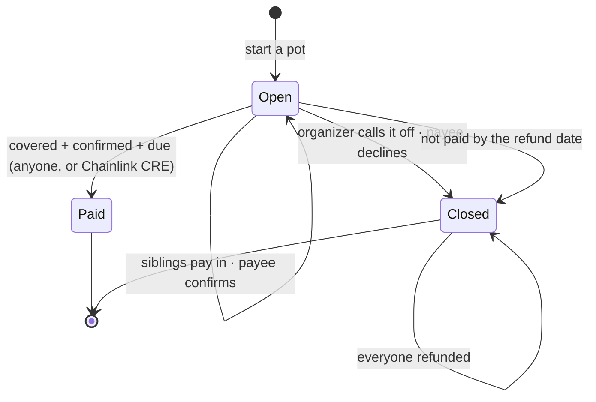

# Kinpot

**Pay the bill, not the person.**

Siblings abroad pool money for a family bill back home: Mummy's hospital bill, the school fees, the rent. The money waits in a pot locked to one payee and one due date. It goes straight to the school, hospital or landlord, and only when the bill is covered, the payee has confirmed it, and the due date has arrived. If any of that doesn't happen, everyone gets back exactly what they put in.

Family and payees sign in with Face ID. There's no seed phrase, no gas token, and the main flow never mentions a blockchain.

**Live app:** [kinpot.vercel.app](https://kinpot.vercel.app) (testnet: free test money in the account menu) · [Architecture](ARCHITECTURE.md)

Built for **Monad Metropolis** (Consumer Products & Payments) on **Monad**, with **AUSD**.

---

## The problem

The Nigerian diaspora sends home over $20B a year, and much of it is earmarked for a specific bill that gets paid through a relative. School-fee scams are common enough that families now tell each other to pay schools directly. When three siblings split a bill today, it means three transfers to one person, a spreadsheet in the WhatsApp group, and trust.

## What Kinpot does

- **One pot per bill.** Name the payee, the amount and the due date, list who's covering what, and share the link in the family group.
- **The payee confirms the bill.** The school or hospital confirms the invoice is real before any money moves. A fake fee notice gets declined, and everyone is refunded.
- **Money goes to exactly two places.** To the payee, or back to whoever paid. No function takes a destination from the caller, and there's no admin key.
- **It pays itself.** A Chainlink CRE workflow pays due pots and refunds expired ones every minute. Anyone can also trigger either action, so nothing depends on us.
- **One tap, no gas.** Contributions are a single EIP-3009 signature on AUSD, bound to the pot. Our relayer pays the MON for gas and never holds anyone's money.
- **Built for the family group.** Names instead of addresses, naira estimates, a WhatsApp share button, and a pot page designed for a phone.

## How it works



## Why it stands out

| | **Kinpot** | MoneyHive (fiat, UK) | Group treasuries (e.g. Hawamoney) | Spraying apps |
|---|---|---|---|---|
| Several senders fund one bill | **Yes, with named shares** | One sender | Yes | No |
| Locked to a named payee | **Yes, onchain** | Operator-enforced | No | No |
| Payee confirms before release | **Yes** | Not documented | No | No |
| Automatic refund | **Yes, by contract** | Operator process | No | No |
| Sign-in | **Passkey, no gas** | Bank account | Wallet | Bank account |

## Deployments

**Monad testnet (10143)**, verified on Sourcify. Test AUSD here is a mock anyone can mint from the in-app faucet.

| Contract | Address |
|---|---|
| `Kinpot` | [`0x0C9131bebCc64148efB2A68cE8ce86Ec0d0eB8B6`](https://testnet.monadexplorer.com/address/0x0C9131bebCc64148efB2A68cE8ce86Ec0d0eB8B6) |
| `KinpotAutomation` (Chainlink CRE receiver) | [`0xCAD3148b80Bb30CA978Caf025386F91944B89A62`](https://testnet.monadexplorer.com/address/0xCAD3148b80Bb30CA978Caf025386F91944B89A62) |
| `ERC2771Forwarder` | [`0x08926B57c8fec6a935aE94BbfaED03266029A2fF`](https://testnet.monadexplorer.com/address/0x08926B57c8fec6a935aE94BbfaED03266029A2fF) |
| Test AUSD | [`0xa1e4BaB1Ca77271a50C3012f861679576bF95D6f`](https://testnet.monadexplorer.com/address/0xa1e4BaB1Ca77271a50C3012f861679576bF95D6f) |

A testnet pot ran the whole lifecycle through the relayer ([see it live](https://kinpot.vercel.app/p/evk83ftz)): [created](https://testnet.monadexplorer.com/tx/0xbce8d05bb12d39bfb183059a409fe5664dacf84090de3f32ed70edfca9b3564d), three gasless contributions, [confirmed by the payee](https://testnet.monadexplorer.com/tx/0x3f9c7747e467d441562fdf28b3a4b553452fbcf697a5990da5c5a932242bd141), [paid out](https://testnet.monadexplorer.com/tx/0x0f7f8d896d06c3eb43b315e8e19c353d4fb03726dc1a13eccfa9a12973b83617). The relayer spent about 0.14 MON for the whole family's flow, faucet included.

**Chainlink CRE paid a pot by itself.** The `kinpot-keeper` workflow (cron → read `pending()` → signed report) found pot #4 covered, confirmed and due, and paid it through the Chainlink forwarder: [report transaction](https://testnet.monadexplorer.com/tx/0x9f20f49a95eb28c1330c089ab4aeb7558b2312f148c7c7fb03f1e068fa62aebc) (`cre workflow simulate --broadcast`).

**Envio indexer:** [`indexer.dev.hyperindex.xyz/d5578e2/v1/graphql`](https://indexer.dev.hyperindex.xyz/d5578e2/v1/graphql) powers the activity feed and payout receipts.

**Monad mainnet (143):** _pending_, using the real AUSD at `0x00000000eFE302BEAA2b3e6e1b18d08D69a9012a`.

## Proof it works

- **Contracts:** 33 unit and fuzz tests, 7 automation tests, and an invariant suite (I1–I7) over 16k random calls each. Fork tests run the gasless lifecycle against **real AUSD on Monad mainnet**. 100% line coverage on `Kinpot.sol`, 98.6% overall, and `forge lint` is clean.
- **End to end:** [`web/scripts/e2e.mjs`](web/scripts/e2e.mjs) plays the whole family story through the real API and relayer. Tobi starts a pot, three siblings pay with one signature each, the bursary confirms, and the bursary is paid.

## Run it

**Contracts** (Foundry):

```bash
cd contracts
forge test --no-match-path "test/fork/*"     # unit, fuzz, invariant
forge test --match-path "test/fork/*" -n monad   # fork tests against mainnet AUSD
```

**Web app** (Next.js 16, viem, wagmi, Mera passkeys) against a local chain:

```bash
anvil                                             # terminal 1
cd contracts && forge script script/Deploy.s.sol \
  --rpc-url http://127.0.0.1:8545 --broadcast --private-key <funded key>
cd ../web && cp .env.example .env.local           # set RELAYER_PRIVATE_KEY (fund it on anvil), NEXT_PUBLIC_ENABLE_LOCAL=1
npm install && npm run sync && npm run dev        # http://localhost:3000
```

Without `DATABASE_URL`, the app uses an embedded Postgres in `web/.data/`. Passkeys need `localhost` or HTTPS.

**Smoke test:** `ADMIN_TOKEN=… node web/scripts/e2e.mjs http://localhost:3000 local <wallets.env>`

## Repository layout

```
contracts/    Kinpot.sol · KinpotAutomation.sol · mocks/MockAUSD.sol · tests (unit, fuzz, invariant, fork)
web/          Next.js app and API routes (relayer, bill details, payee directory, keeper)
indexer/      Envio HyperIndex: pots, participants, activity feed
automation/   Chainlink CRE workflow (TypeScript → wasm)
```

## Roadmap

- **Payee-initiated bills:** a school issues a Kinpot link per student to parents abroad.
- **Naira payout** for payees through a licensed partner.
- **Recurring pots** for monthly rent.
- **Yield on the float** (earnAUSD) for pots due weeks out. See the decision log in [ARCHITECTURE.md](ARCHITECTURE.md).

## Disclaimer

Kinpot is unaudited hackathon software. Payees shown in demos are fictional.
